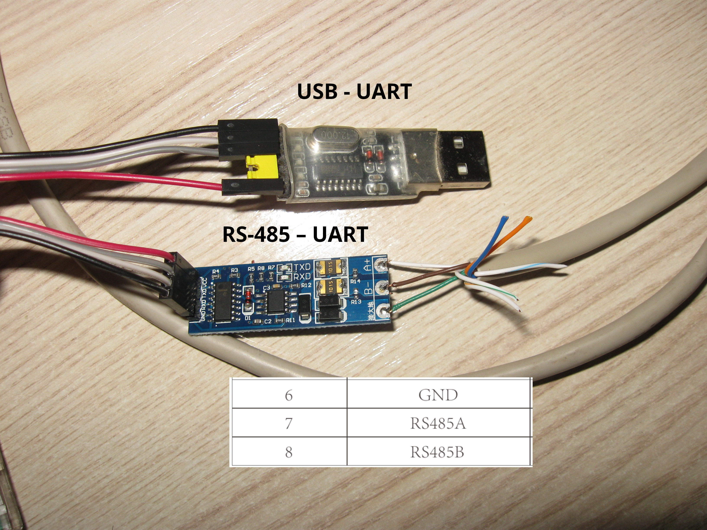
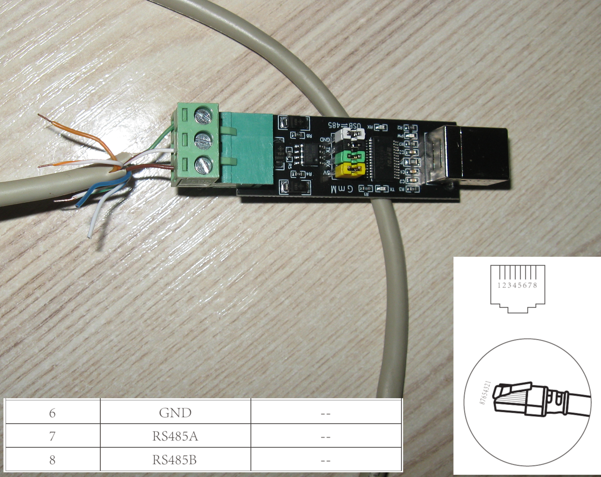
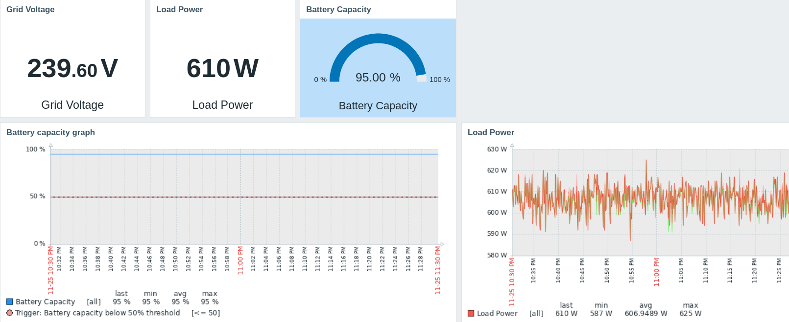

# Deye Agent

`deye-agent` is a command-line tool and system service for reading data from Deye inverters via RS485. It is designed to run on Linux and can operate as a systemd service, optionally pushing metrics to MQTT or other monitoring systems.

---

## Features
- Reads data from Deye inverters over **RS485**  
- Runs as a **systemd service**  
- Can publish metrics to MQTT  
- Includes examples for integration with **Zabbix Agent 2**  
- Lightweight and easy to deploy  
- Tested on:  
  - **SUN-6K-SG03LP1-EU**

---

## Requirements
- Python 3.x  
- Linux system (systemd recommended)  
- Access to a Deye inverter via **RS485 interface**  
- USB-RS485 or RS485–UART–TTL adapter (see connection examples below)

---

## Installation and Setup

Clone the repository, install the package, and set up the systemd service with the following commands:

git clone https://github.com/khvalera/deye-agent.git  
cd deye-agent  
python3 setup.py install  
cp etc/deye-agent.service /etc/systemd/system/  
systemctl daemon-reload  
systemctl enable deye-agent.service  
systemctl start deye-agent.service

---

## Configuration Files

Sample configuration files are provided in the repository under:

`etc/deye-agent/`

These files allow you to configure various settings of the deye-agent, including:

- Serial port parameters (e.g., device path, baud rate)  
- MQTT broker connection details  
- Polling intervals and timeouts  
- Logging options  

Before running the agent, make sure to review and customize these configuration files according to your hardware and network environment.

---

## RS485 Connection Examples

Connection examples for the **SUN-6K-SG03LP1-EU** model are available in:

  
  

These images show how to connect the inverter to a USB-RS485 or RS485–UART–TTL interface.

> For other inverter models, please refer to their official documentation, as RS485 pinouts may differ.

---

## Zabbix Integration

Example files for Zabbix Agent 2 are provided in:

`data/zabbix_agent2/`

### Included files:

- `deye_agent_mqtt.conf`  
  Example configuration file for Zabbix Agent 2, enabling data collection via MQTT.

- `zbx_deye_agent_template.yaml`  
  Zabbix template for importing item prototypes, triggers, and monitoring metrics from deye-agent.

Here is a visualization of the Zabbix template:

---

## Usage

After installation, the agent can be started manually:

deye-agent

Or monitored via systemd:

systemctl status deye-agent.service

---

## License

This project is licensed under the **Apache License 2.0**.

---

## Contributing

Pull requests and issue reports are welcome. If you encounter problems with specific inverter models, please open an issue with details.
