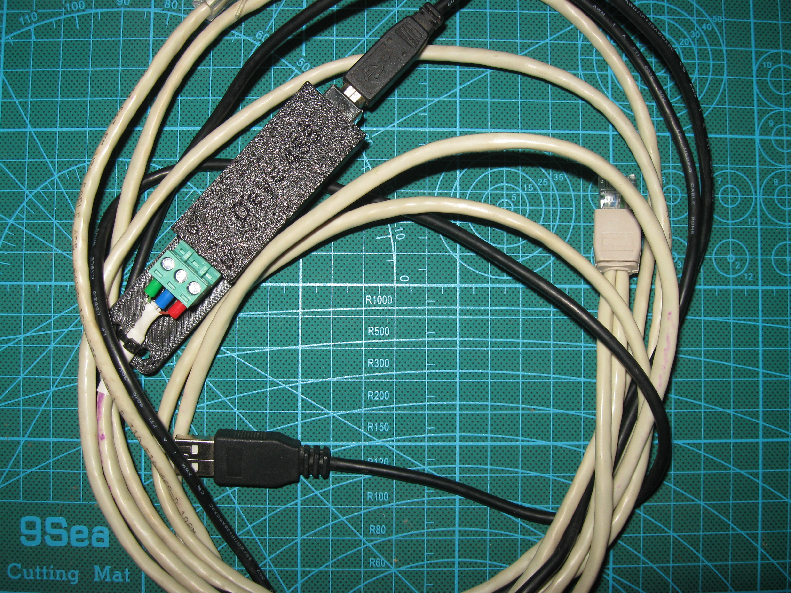
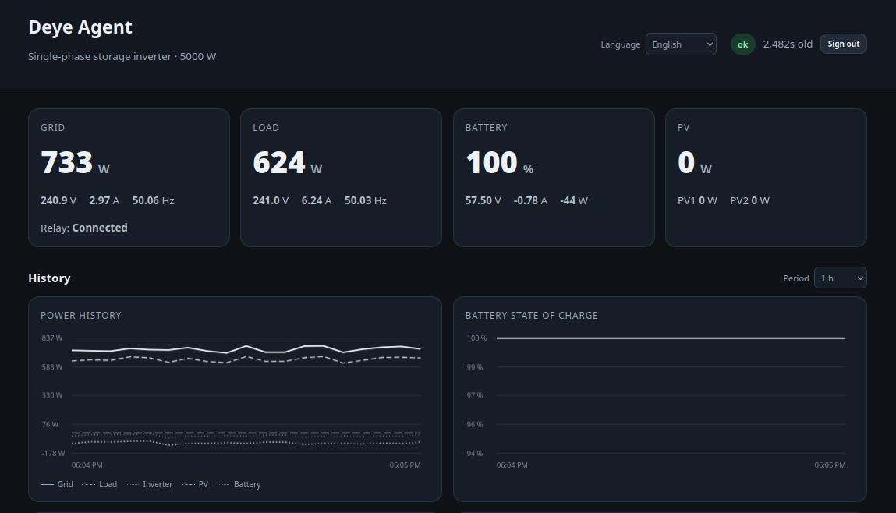

# Deye Agent

[English](README.md) | [Українська](README_UK.md)

`deye-agent` — це сумісний з Python 3.6 агент моніторингу для інверторів Deye,
підключених через RS485/Modbus RTU. Він надає CLI-діагностику, нормалізовані
метрики, публікацію через MQTT, кешований HTTP API та read-only web dashboard.

Поточний production-шлях навмисно залишається консервативним: звичайний
моніторинг використовує лише перевірені read-only регістри та не надає
керування записом у параметри інвертора.

## Основні можливості релізу 0.2.0

- Надійне читання RS485 з повторними спробами та суворою перевіркою Modbus-відповідей.
- Глобальне блокування доступу до інвертора для запобігання одночасному доступу локальних процесів.
- Профілі протоколу з апаратно перевіреним профілем `single_phase_storage`.
- Read-only команди для device info, battery/BMS, settings, system status та snapshot.
- Стабільна нормалізована схема метрик із **89 metric IDs**.
- Стабільні MQTT topics для метрик разом із legacy MQTT payload.
- Кешований HTTP API, який не створює RS485-запитів із браузера.
- Адаптивний web dashboard із live overview та RAM-only history charts.
- Переклади web UI: English, Українська, Polski, Deutsch.
- Обов'язковий захист login/password, якщо HTTP API увімкнений.
- PBKDF2-SHA256 hashing пароля та RAM-only authenticated sessions.
- Стабільне форматування значень напруги, струму та частоти.

Детальний список змін дивись у [CHANGELOG.md](CHANGELOG.md).

## Статус апаратної перевірки профілів

### `single_phase_storage`

Статус: **hardware-validated**.

Поточна перевірка виконувалась на **5 kW single-phase storage inverter**.
Точний ідентифікатор моделі цього інвертора поки не записаний, тому профіль
навмисно має назву за сімейством інвертора, а не за конкретною моделлю.

### `three_phase_storage`

Статус: **reference-only**.

Трифазна карта зберігається окремо, тому що значення регістрів відрізняються
між однофазними та трифазними сімействами. Вона не використовується для
звичайного runtime polling до окремої апаратної перевірки.

## Вимоги

- Python **3.6+**.
- Linux.
- RS485-доступ до інвертора.
- `pyserial`, `PyYAML`, `paho-mqtt`, `chardet`, `idna`.

Поточне production-середовище ClearOS використовує Python 3.6.8.

## Встановлення

```bash
git clone https://github.com/khvalera/deye-agent.git
cd deye-agent
python3 setup.py install
```

Перевір приклад конфігурації в:

```text
data/etc/deye-agent/
```

Апаратно перевірений runtime-профіль зазвичай встановлюється як:

```text
/etc/deye-agent/profiles/single_phase_storage.yaml
```


## Приклади підключення RS485

У репозиторії залишаються початкові фотографії та схеми підключення. Вони
корисні для підключення інвертора через USB-RS485 або RS485-UART-TTL адаптер.

### RS485-UART-TTL

[](data/images/RS485–UART-TTL.JPG)

### USB-RS485

[](data/images/USB-RS485-1.png)

[](data/images/USB-RS485-2.JPG)

> RS485 pinout може відрізнятися між сімействами інверторів. Перед
> підключенням потрібно перевірити pinout саме для конкретного інвертора.

## Базове використання

Показати список профілів протоколу:

```bash
deye-agent profiles
```

Прочитати поточну телеметрію:

```bash
deye-agent --profile single_phase_storage read
```

Прочитати повний read-only snapshot:

```bash
deye-agent --profile single_phase_storage snapshot --json
```

Прочитати нормалізовані метрики:

```bash
deye-agent --profile single_phase_storage metrics --json
```

Запустити monitoring loop:

```bash
deye-agent \
  --config /etc/deye-agent/deye-agent.conf \
  --profile single_phase_storage \
  run
```

Доступні також read-only/diagnostic команди:

```text
raw-read
info
battery
settings
system
snapshot
metrics
publish-metrics
inventory
profiles
```

## Stable metrics та MQTT

Реліз 0.2.0 надає **89 stable metric IDs** у схемі
`deye-agent.metrics.v1`.

Якщо увімкнено обидва параметри:

```text
MQTT_ENABLED=true
MQTT_METRICS_ENABLED=true
```

stable metrics публікуються в:

```text
<MQTT_TOPIC>/metrics/<stable.metric.id>
```

Legacy MQTT output також збережений.

MQTT client використовує MQTT 3.1.1, обмежений час очікування connection/publish
та явну перевірку завершення публікації.


## Інтеграція з Zabbix

Початкові приклади інтеграції із Zabbix Agent 2 залишаються в:

```text
data/zabbix_agent2/
```

У репозиторії також залишається існуючий скріншот Zabbix template:

[](data/images/zabbix-deye-agent.png)

## HTTP API та dashboard

HTTP layer читає лише runtime cache. Відкриття або оновлення сторінки в браузері
**не створює додаткових Modbus-запитів**.

Увімкнення:

```text
HTTP_API_ENABLED=true
HTTP_API_HOST=0.0.0.0
HTTP_API_PORT=8765
```

API endpoints:

```text
GET /api/v1/health
GET /api/v1/overview
GET /api/v1/history?minutes=60
GET /api/v1/metrics
GET /api/v1/snapshot
```

### Авторизація

Авторизація обов'язкова, якщо `HTTP_API_ENABLED=true`.

Для створення password hash:

```bash
deye-agent auth-hash
```

Після цього налаштуй:

```text
HTTP_AUTH_USERNAME=admin
HTTP_AUTH_PASSWORD_HASH=pbkdf2_sha256$...
HTTP_AUTH_SESSION_SECONDS=43200
HTTP_AUTH_COOKIE_SECURE=false
```

Якщо username або password hash відсутній, HTTP API працює за принципом
**fail closed** і не відкриває анонімний dashboard.

Без валідної browser session:

```text
GET /           -> redirect to /login
GET /api/v1/*   -> HTTP 401
```

Паролі перевіряються через PBKDF2-HMAC-SHA256 із випадковим salt.
Browser sessions використовують випадкові server-side tokens, які зберігаються
лише в RAM. Session cookies мають `HttpOnly` та `SameSite=Strict`.

`HTTP_AUTH_COOKIE_SECURE=true` потрібно використовувати лише тоді, коли браузер
реально звертається до сервісу через HTTPS.

> Звичайний HTTP не шифрує login/password у мережі. Для захисту credentials
> використовуй HTTPS або довірену ізольовану мережу.

## Dashboard




Dashboard не має зовнішніх залежностей і читає `/api/v1/overview` та history endpoint.

Він показує:

- Grid input power, voltage, current та frequency.
- Явний статус підключення до мережі.
- Load power, inverter output voltage, load current та load frequency.
- Battery state of charge, voltage, current, power та BMS information.
- PV values.
- Daily energy totals.
- Operating status і короткий configuration summary.
- Historical charts для power, battery SOC, grid input voltage,
  battery voltage та inverter output voltage.

Числове форматування в UI стабільне, наприклад:

```text
234.0 V
6.50 A
50.00 Hz
```

а не змінює ширину через зникнення нулів у кінці.

Підтримувані web-мови:

```text
English
Українська
Polski
Deutsch
```

## RAM history

History у релізі 0.2.0 навмисно зберігається лише в RAM:

```text
HTTP_HISTORY_ENABLED=true
HTTP_HISTORY_MAX_SAMPLES=720
HTTP_HISTORY_RETENTION_SECONDS=21600
```

Після нового запуску процесу history починається заново.
Persistent on-disk history не входить у реліз 0.2.0.

## Read-only покриття регістрів

Реліз включає перевірені read-only mappings для:

- Device information.
- Energy/statistics.
- PV/DC data.
- Real-time grid/inverter/load/battery telemetry.
- Warnings/fault status.
- Battery/BMS summary.
- Selected inverter settings.
- Selected system/status values.

Два важливі значення, додані під час поточної hardware validation:

```text
Register 79  -> Grid input frequency, scale 0.01 Hz
Register 150 -> Grid input voltage, scale 0.1 V
Register 154 -> Inverter output voltage, scale 0.1 V
```

Reserved або revision-sensitive регістри не отримують семантику без перевірки.

## Надійність RS485

Read path включає:

- Exclusive serial-open mode, якщо підтримується.
- Configurable retry attempts.
- Retry delay.
- Exact response length validation.
- Slave-ID validation.
- Function-code validation.
- Byte-count validation.
- CRC validation.
- Process-wide Linux abstract UNIX-socket lock навколо доступу до інвертора.

Normal telemetry зберігає існуючий цикл open/read/close.
Combined snapshot використовує одну спільну serial session для coalesced read blocks.

## Підтвердження alarm

Alarm notifications можуть вимагати кілька послідовних валідних abnormal samples:

```text
ALARM_CONFIRMATIONS=2
```

Failed/absent read не зараховується як підтвердження.

## Ліцензія

Apache License 2.0.
